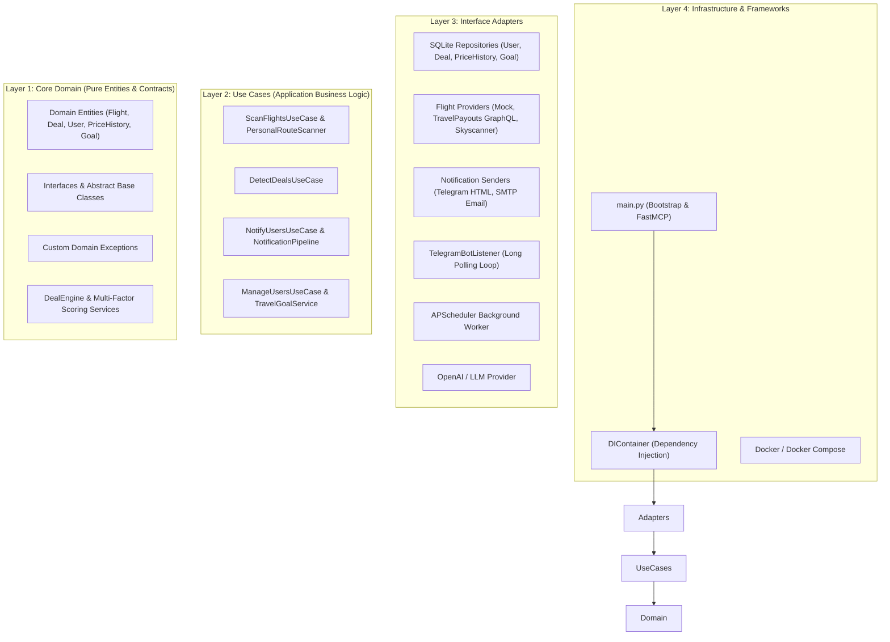

# SkyDeal AI ✈️

[](https://www.python.org/)
[](https://blog.cleancoder.com/uncle-bob/2012/08/13/the-clean-architecture.html)
[](https://github.com/jlowin/fastmcp)
[](https://github.com/astral-sh/ruff)
[](https://mypy-lang.org/)
[](https://docs.pytest.org/)
[](https://www.docker.com/)
[](LICENSE)

**SkyDeal AI** is an enterprise-grade, autonomous flight deal monitoring and price intelligence engine built with Python 3.13 and strict Clean Architecture principles. It periodically scans flight prices across configurable origin airports and regional destination strategies, calculates statistical price baselines (Exponential Moving Averages, historical lowest/highest), scores price drops using a multi-factor deal engine, and dispatches real-time alerts via **Telegram (HTML Cards)** and **SMTP Email**.

Designed as a Model Context Protocol (**MCP**) server, SkyDeal AI allows AI agents (e.g. Claude Desktop, Cursor) to execute flight deal queries, trigger manual route scans, and manage user alert preferences on demand.

---

## ⚡ Executive Summary (For Recruiters & Maintainers)

* **Architecture First**: Pure 4-layer Hexagonal / Clean Architecture. The core Domain has zero third-party dependencies.
* **Pluggable Data Providers**: Built-in support for `TravelPayouts GraphQL API`, `MockFlightProvider` (for testing/simulations), and `Skyscanner` plugin interface.
* **Intelligent Deal Detection**: Evaluates price variances against historical rolling averages, discount thresholds, country budget caps, and regional strategies (Asia, Middle East, Europe).
* **AI-Native MCP Support**: Exposes FastMCP tools for seamless integration with LLMs and AI agent workflows.
* **Production Engineering**: Complete dependency injection container, SQLite with WAL mode, duplicate alert suppression with route cooldown timers, automated log data masking (secrets/chat IDs), and full Docker volume persistence.

---

## ✨ Key Features

| Category | Feature | Description |
| :--- | :--- | :--- |
| 🔍 **Flight Scanning** | Multi-Origin & Regional Scanning | Automatically scans departures from multiple origin airports (e.g. `DEL`, `BOM`, `BLR`) across customizable destination regions and travel windows. |
| 🧠 **Deal Engine** | Multi-Factor Deal Scoring | Categorizes flight deals into `Normal`, `Good Deal`, `Great Deal`, and `Super Deal` using Exponential Moving Averages (EMA) and price variance percentile metrics. |
| 🛡️ **Alert Protection** | Cooldown & Deduplication | Enforces route-level notification cooldowns and duplicate deal filters to prevent user alert spam. |
| 💬 **Telegram Bot** | Conversational & Alerts | Long-polling bot listener capable of parsing natural language user goals, serving commands (`/show`, `/add_goal`, `/pause`, `/resume`), and sending rich HTML deal cards. |
| ✉️ **Email Dispatch** | Secondary Alert Channel | Async SMTP email notifier with structured fallback logic if primary notification channels are unavailable. |
| 🤖 **FastMCP Server** | Model Context Protocol | Exposes operational tools for AI clients to trigger manual scans, fetch recent deals, and register alert subscribers dynamically. |
| 🔒 **Security & Privacy** | Log Data Sanitization | Automated log masking for API tokens, secret keys, user Telegram Chat IDs, and email addresses. |

---

## 🛠️ Tech Stack

### Core Runtime & Frameworks
* **Language**: [Python 3.13+](https://www.python.org/)
* **Package Manager**: [uv](https://github.com/astral-sh/uv) (Fast Python package installer & environment manager)
* **Architecture**: Clean Architecture / SOLID Principles / Hexagonal Design Pattern
* **AI Protocol**: [FastMCP Server Framework](https://github.com/jlowin/fastmcp)
* **Scheduling**: [APScheduler](https://github.com/agronholm/apscheduler) (Advanced Python Scheduler)
* **HTTP Client**: [HTTPX](https://www.python-httpx.org/) (Async HTTP client with connection pooling)

### Storage & Infrastructure
* **Database**: SQLite 3 with **Write-Ahead Logging (WAL)** mode enabled
* **Containerization**: Docker & Docker Compose (Multi-stage build)
* **Configuration**: Pydantic & `pydantic-settings` with environment variable validation
* **Logging**: Loguru (Structured color logging with privacy masking)

### Testing & Code Quality
* **Test Suite**: Pytest with Asyncio integration (`pytest-asyncio`)
* **Linter & Formatter**: Ruff (`ruff check`, `ruff format`)
* **Static Type Checker**: Mypy (`mypy src`)
* **CI/CD**: GitHub Actions (Automated linting, type checks, and test suite execution)

---

## 🏗️ Architecture & System Design

SkyDeal AI follows **Clean Architecture (Hexagonal Architecture)** guidelines, enforcing strict unidirectional dependency flow from the outer infrastructure inward toward the core domain.



### Clean Architecture Layers Breakdown

1. **Domain Layer (`src/domain/`)**:
   - Contains pure Python business entities ([entities.py](file:///C:/Users/iampr/Projects/Skyscanner/FlightPulseAI/src/domain/entities.py)), custom exceptions ([exceptions.py](file:///C:/Users/iampr/Projects/Skyscanner/FlightPulseAI/src/domain/exceptions.py)), and interface contracts ([interfaces.py](file:///C:/Users/iampr/Projects/Skyscanner/FlightPulseAI/src/domain/interfaces.py)).
   - Enforces business rules for flight deal scoring ([deal_engine.py](file:///C:/Users/iampr/Projects/Skyscanner/FlightPulseAI/src/domain/deal_engine.py)) and price intelligence without relying on external libraries, web frameworks, or databases.

2. **Use Cases Layer (`src/use_cases/`)**:
   - Orchestrates application business transactions:
     - `ScanFlightsUseCase`: Coordinates scheduled and manual scanning loops across configured routes.
     - `DetectDealsUseCase`: Processes fetched flight offers through the Deal Engine.
     - `NotificationPipeline`: Manages user alert filtering, route cooldown timers, duplicate suppression, and alert dispatch.
     - `TravelGoalService`: Manages user travel goals, budgets, and destination constraints.

3. **Interface Adapters Layer (`src/adapters/`)**:
   - Mappings between inner core requirements and outer world technologies:
     - **Database**: SQLite WAL mode repository implementations for Users, Price History, Deals, and Travel Goals ([repository.py](file:///C:/Users/iampr/Projects/Skyscanner/FlightPulseAI/src/adapters/database/repository.py)).
     - **Providers**: Pluggable providers implementing `FlightProvider` interface (`MockFlightProvider`, `TravelPayoutsClient` GraphQL integration, `Skyscanner`).
     - **Notifications**: `TelegramNotificationSender` (HTML cards with retry backoff and token masking) and `EmailNotificationSender` (SMTP).
     - **Scheduler**: APScheduler integration for periodic scanning jobs.

4. **Infrastructure Layer (`src/infrastructure/`)**:
   - Contains dependency injection container setup ([di_container.py](file:///C:/Users/iampr/Projects/Skyscanner/FlightPulseAI/src/infrastructure/di_container.py)) and runtime initialization logic.

---

## 📁 Repository Structure

```
FlightPulseAI/
├── .github/
│   └── workflows/
│       └── ci.yml                     # GitHub Actions CI pipeline
├── data/                              # Local SQLite storage directory (Git-ignored)
├── docs/                              # Project documentation & visual assets
│   └── images/                        # Screenshot & preview placeholders
├── src/
│   ├── main.py                        # Application entrypoint & FastMCP setup
│   ├── config.py                      # Pydantic configuration & env settings
│   ├── destination_regions.py         # Regional alert definitions (Asia, Europe, etc.)
│   ├── utils.py                       # Data masking utilities (Chat ID, Token masking)
│   ├── domain/                        # Layer 1: Core Domain entities & contracts
│   │   ├── entities.py
│   │   ├── exceptions.py
│   │   ├── interfaces.py
│   │   ├── deal_engine.py
│   │   └── notification_formatter.py
│   ├── use_cases/                     # Layer 2: Business Logic Orchestration
│   │   ├── detect_deals.py
│   │   ├── manage_users.py
│   │   ├── notification_pipeline.py
│   │   └── scan_flights.py
│   ├── adapters/                      # Layer 3: Technical Adapters
│   │   ├── ai/                        # Conversational LLM providers
│   │   ├── database/                  # SQLite connection & repositories
│   │   ├── notifications/             # Telegram & Email notification clients
│   │   ├── providers/                 # Flight API clients (TravelPayouts/Mock)
│   │   ├── scheduler/                 # APScheduler worker configuration
│   │   └── telegram_command_handler.py # Telegram bot command router
│   └── infrastructure/                # Layer 4: Infrastructure & Container
│       └── di_container.py
├── tests/                             # Pytest unit & integration test suites (196 tests)
├── .env.example                       # Environment configuration template
├── .gitignore                         # Strict git exclusion rules
├── Dockerfile                         # Production multi-stage Docker build
├── docker-compose.yml                 # Container deployment orchestration
├── LICENSE                            # MIT License
├── pyproject.toml                     # Dependency definitions & tool configs
└── README.md                          # Project documentation
```

---

## ⚙️ Configuration & Environment Variables

Create a `.env` file at the root of the project by copying the provided template:

```bash
cp .env.example .env
```

### Environment Parameters Overview

```ini
ENV=development
LOG_LEVEL=INFO
DB_PATH=data/skydeal.db
SCAN_INTERVAL_HOURS=1
FLIGHT_PROVIDER=mock

# TravelPayouts API Settings
TRAVELPAYOUTS_API_TOKEN=your_travelpayouts_api_token_here
TRAVELPAYOUTS_BASE_URL=https://api.travelpayouts.com/graphql/v1/query
TRAVELPAYOUTS_PAGE_SIZE=300

# Telegram Alert Settings
TELEGRAM_BOT_TOKEN=your_telegram_bot_token_here
TELEGRAM_DEFAULT_CHAT_ID=your_telegram_chat_id_here
TELEGRAM_COOLDOWN_SECONDS=3600

# Conversational AI (Optional)
OPENAI_API_KEY=your_openai_api_key_here
LLM_PROVIDER=openai
MODEL_NAME=gpt-4o-mini

# Flight Scanning Limits & Filters
SCAN_ORIGINS=DEL,BOM,BLR,HYD,MAA,CCU
ALLOWED_DESTINATION_COUNTRIES=Thailand,Vietnam,Singapore,Malaysia,Indonesia,Japan,South Korea,United Arab Emirates,Germany,France,Italy
MAX_DAYS_AHEAD=120
COUNTRY_MAX_BUDGETS=Thailand:15000,Vietnam:15000,Singapore:15000,Malaysia:15000,Indonesia:15000,United Arab Emirates:18000,Japan:25000,South Korea:22000,Germany:35000,France:35000,Italy:35000
MAX_DEALS_PER_SCAN=10
MIN_NOTIFICATION_CATEGORY=GOOD

# SMTP Email Alert Settings (Secondary)
SMTP_HOST=smtp.gmail.com
SMTP_PORT=587
SMTP_USERNAME=your_email@gmail.com
SMTP_PASSWORD=your_app_password
SMTP_FROM_EMAIL=your_email@gmail.com
```

### Advanced Filtering Parameters
* `SCAN_ORIGINS`: Comma-separated list of 3-letter IATA airport codes monitored during scans (e.g. `DEL,BOM,BLR`).
* `ALLOWED_DESTINATION_COUNTRIES`: Whitelisted destination countries allowed for deal evaluation.
* `MAX_DAYS_AHEAD`: Scanning window cap for future departure dates (in days).
* `COUNTRY_MAX_BUDGETS`: Country-level budget ceilings formatted as `CountryName:MaxBudgetINR`.
* `MIN_NOTIFICATION_CATEGORY`: Minimum deal tier required to trigger notifications (`GOOD`, `GREAT`, `SUPER`).

---

## 🚀 Getting Started

### Prerequisites
* **Python**: 3.13 or higher
* **uv**: Fast Python package manager ([Installation Guide](https://github.com/astral-sh/uv))

### 1. Clone & Install Dependencies
```bash
# Clone the repository
git clone https://github.com/gpriyanshu/skydeal-ai.git
cd skydeal-ai

# Synchronize virtual environment dependencies
uv sync --all-groups
```

### 2. Configure Environment
```bash
cp .env.example .env
# Edit .env to add your TELEGRAM_BOT_TOKEN and TELEGRAM_DEFAULT_CHAT_ID
```

### 3. Run the Application
To run the background scheduler worker (which performs an initial startup scan):
```bash
uv run python -m src.main
```

---

## 🤖 Model Context Protocol (FastMCP) Integration

SkyDeal AI includes a built-in Model Context Protocol (**MCP**) server, enabling direct control from LLM environments like **Claude Desktop**, **Cursor**, or custom AI agents.

### Launching the MCP Server
```bash
uv run fastmcp dev src/main.py
```

### Exposed MCP Tools

#### 1. `run_manual_scan()`
Triggers an on-demand price scan across all default routes and returns execution status.
```json
// Example Output
"Flight scan completed successfully. Check logs for detected deals."
```

#### 2. `get_recent_deals(limit: int = 5)`
Retrieves the most recently detected flight deals from the database.
```json
// Example Output
"- [SUPER] DEL -> BKK on 2026-09-15 for $11200.0 (Avg: $18500.0, Save 39.46%)
 - [GREAT] BOM -> SIN on 2026-10-01 for $13500.0 (Avg: $19000.0, Save 28.95%)"
```

#### 3. `register_alert_subscriber(chat_id: str, budget: float, origin: str)`
Registers a new alert subscriber with preferred origin and budget cap.
```json
// Example Output
"Subscriber 123456789 registered successfully for origin DEL with budget $15000.0."
```

---

## 🧪 Testing & Code Quality

SkyDeal AI maintains a comprehensive suite of **196 unit and integration tests** covering domain deal logic, repository transactions, provider mappers, and notification pipelines.

```bash
# Run linting and style check
uv run ruff check .

# Check code formatting
uv run ruff format --check .

# Run static type check
uv run mypy src

# Run full test suite with Pytest
uv run pytest
```

---

## 🐳 Docker Deployment

SkyDeal AI is containerized using a multi-stage Docker build for minimal image size and fast execution.

### Running with Docker Compose
```bash
# Build and start container in detached mode
docker-compose up --build -d

# Check container logs
docker-compose logs -f skydeal-ai-service

# Stop container service
docker-compose down
```

Data Persistence: All flight price history, user subscriptions, and notification records persist across container restarts inside the named Docker volume `skydeal-data` mapped to `/app/data`.

---

## 📸 Screenshots & Visual Previews

<!-- Screenshot Placeholder: Add real screenshots to docs/images/ -->
| Feature | Preview |
| :--- | :--- |
| **Telegram HTML Deal Card** | <br>*(Rich formatted HTML cards with price comparison, savings percentage, and direct booking links)* |
| **MCP AI Server Integration** | <br>*(FastMCP tools integrated into Claude Desktop / Cursor)* |

*(Place screenshot images in `docs/images/` to display previews in GitHub)*

---

## 🗺️ Project Roadmap & Future Improvements

- [x] Clean Architecture foundation with SOLID principles
- [x] Multi-provider plugin support (Mock, TravelPayouts GraphQL)
- [x] EMA-based Deal Engine & Multi-factor scoring
- [x] Telegram HTML Notifications with exponential backoff & log masking
- [x] FastMCP Server integration for AI agent control
- [x] 100% Pytest test suite pass rate (196 tests)
- [ ] **Phase 2: Live Skyscanner Provider Expansion**: Complete full session search integration.
- [ ] **Phase 3: Web Dashboard**: Build an interactive React/Next.js dashboard for visualizing price trends.
- [ ] **Phase 4: Multi-Currency Intelligence**: Live exchange rate synchronization with fallback caching.

---

## 🔒 Security & Privacy

* **Secrets Management**: Secrets (tokens, API keys, chat IDs) are strictly loaded via environment variables ([.env](file:///C:/Users/iampr/Projects/Skyscanner/FlightPulseAI/.env)) and are **never** committed to version control.
* **Log Privacy Protection**: Log output uses custom masking functions ([src/utils.py](file:///C:/Users/iampr/Projects/Skyscanner/FlightPulseAI/src/utils.py)) to redact sensitive user Telegram Chat IDs (`******2811`), API tokens, and recipient emails.

---

## 🤝 Contributing

Contributions are welcome! Please follow these guidelines:
1. Fork the repository and create your feature branch (`git checkout -b feature/amazing-feature`).
2. Ensure all tests pass (`uv run pytest`), type checks pass (`uv run mypy src`), and code is formatted (`uv run ruff format .`).
3. Commit your changes (`git commit -m 'feat: add amazing feature'`).
4. Push to the branch (`git push origin feature/amazing-feature`).
5. Open a Pull Request.

---

## 📄 License

This project is licensed under the **MIT License** - see the [LICENSE](LICENSE) file for details.

---

## 💬 Support & Contact

If you have questions, encounter issues, or want to suggest new features:
* **Issues**: Open a GitHub Issue at [SkyDeal AI Issues](https://github.com/gpriyanshu/skydeal-ai/issues)
* **Author**: Priyanshu Gupta ([@gpriyanshu](https://github.com/gpriyanshu))

---

## ❓ FAQ & Troubleshooting

<details>
<summary><b>1. Why am I getting "TRAVELPAYOUTS_API_TOKEN is not configured"?</b></summary>
Ensure you have copied <code>.env.example</code> to <code>.env</code> and populated the <code>TRAVELPAYOUTS_API_TOKEN</code> parameter, or set <code>FLIGHT_PROVIDER=mock</code> for testing without an API key.
</details>

<details>
<summary><b>2. How does the duplicate deal suppression work?</b></summary>
The Notification Pipeline checks historical notifications for the same origin/destination route. If an alert was dispatched within the <code>TELEGRAM_COOLDOWN_SECONDS</code> window (default: 3600s), duplicate alerts are automatically suppressed.
</details>

<details>
<summary><b>3. Can I run SkyDeal AI without Docker?</b></summary>
Yes! Simply install <code>uv</code>, run <code>uv sync --all-groups</code>, configure your <code>.env</code>, and execute <code>uv run python -m src.main</code> locally.
</details>
