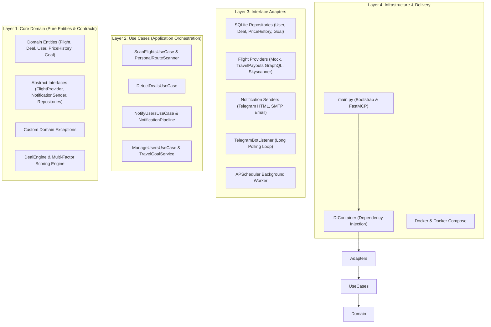
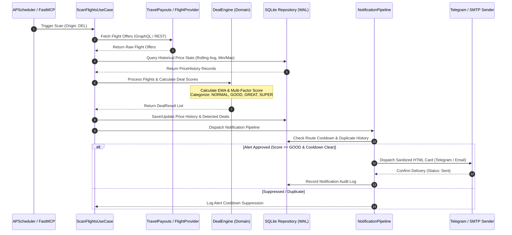

# SkyDeal AI ✈️

[](https://www.python.org/)
[](https://blog.cleancoder.com/uncle-bob/2012/08/13/the-clean-architecture.html)
[](https://github.com/jlowin/fastmcp)
[](https://github.com/astral-sh/ruff)
[](https://mypy-lang.org/)
[](https://docs.pytest.org/)
[](https://www.docker.com/)
[](LICENSE)

**SkyDeal AI** is an enterprise-grade, autonomous flight deal monitoring and price intelligence platform built with **Python 3.13** and strict **Clean Architecture (Hexagonal Architecture)** guidelines.

The system continuously scans airfare prices across configurable origin hubs (`DEL`, `BOM`, `BLR`, `HYD`, `MAA`, `CCU`), calculates statistical baselines using **Exponential Moving Averages (EMA)**, evaluates market price variances with a multi-factor scoring engine, and dispatches real-time alerts via **Telegram (HTML Cards with exponential backoff)** and **SMTP Email**.

Exposed natively as a **Model Context Protocol (FastMCP)** server, SkyDeal AI allows AI agents (e.g., Claude Desktop, Cursor) to execute manual price scans, inspect recent deals, and onboard alert subscribers on demand.

---

## ⚡ Executive Summary (For Recruiters & Staff Engineers)

### Why This Project Stands Out

* 🏛️ **Decoupled 4-Layer Architecture**: Core business domain ([src/domain/](file:///C:/Users/iampr/Projects/Skyscanner/FlightPulseAI/src/domain/)) has **zero third-party dependencies**. Web frameworks, APIs, databases, and notification channels are pluggable interface adapters.
* 📈 **Statistical Price Intelligence**: Uses Exponential Moving Averages (EMA), historical min/max bounds, and regional budget caps to calculate flight deal scores ($0.0 - 100.0$) and categorize deals (`Normal`, `Good`, `Great`, `Super`).
* 🔌 **Pluggable Provider Architecture**: Implements a unified `FlightProvider` interface supporting `TravelPayouts GraphQL API`, `MockFlightProvider` (for testing/simulations), and `Skyscanner` plugin interface.
* 🤖 **AI Agent Native (FastMCP)**: Built-in Model Context Protocol server exposing JSON schema tools directly to LLMs.
* 🛡️ **Production Reliability**: 100% passing test suite (**196 Pytest cases**), Dependency Injection Container, SQLite with WAL mode enabled, duplicate deal suppression with route cooldown timers, and automated log sanitization (masking API keys, tokens, and Chat IDs).

---

## ✨ Key Features & Capabilities

| Category | Feature | Technical Implementation |
| :--- | :--- | :--- |
| 🔍 **Flight Scanning** | Multi-Origin & Regional Hubs | Automated scanning across multi-origin hubs (`DEL`, `BOM`, `BLR`, `HYD`, `MAA`, `CCU`) and regional strategies (`Asia`, `Middle East`, `Europe`). |
| 🧮 **Price Engine** | Statistical Baseline & EMA | Maintains rolling averages ($EMA_t = \alpha P_t + (1-\alpha) EMA_{t-1}$) and statistical min/max ranges per origin-destination pair. |
| 🎯 **Deal Scoring** | Multi-Factor Deal Engine | Evaluates historical discount percentage, market percentile, country budget floors, and seasonality to assign deal tiers (`GOOD`, `GREAT`, `SUPER`). |
| 🛡️ **Alert Protection** | Route Cooldown & Suppression | Enforces route-level cooldown timers (`TELEGRAM_COOLDOWN_SECONDS`) and duplicate notification filtering to prevent alert spam. |
| 💬 **Telegram Bot** | Conversational Listener | Asynchronous long-polling worker ([telegram_bot_listener.py](file:///C:/Users/iampr/Projects/Skyscanner/FlightPulseAI/src/adapters/notifications/telegram_bot_listener.py)) serving natural language goal commands (`/show`, `/add_goal`, `/pause`, `/resume`). |
| ✉️ **Email Alerts** | Async SMTP Dispatcher | Asynchronous MIME HTML email notification client with fallback error handling. |
| 🤖 **FastMCP Server** | Model Context Protocol | Exposes operational tools (`run_manual_scan`, `get_recent_deals`, `register_alert_subscriber`) for LLM agent integration. |
| 🔒 **Security & Privacy** | Log Data Sanitization | Custom masking utility ([src/utils.py](file:///C:/Users/iampr/Projects/Skyscanner/FlightPulseAI/src/utils.py)) redacting Telegram Chat IDs (`******2811`), API tokens, and emails in logs. |

---

## 🛠️ Tech Stack & Architectural Choices

### Core Runtime & Engineering Standards

| Technology | Role | Technical Rationale |
| :--- | :--- | :--- |
| **Python 3.13+** | Core Language | Utilizes modern syntax features, strict typing (`list[str] \| str`), and performance optimizations. |
| **uv** | Package Manager | Fast Python package installer and virtual environment manager (10-100x faster than standard `pip`). |
| **Clean Architecture** | Design Pattern | Ensures absolute separation of concerns. Domain entities do not import frameworks or HTTP clients. |
| **FastMCP** | AI Integration | Exposes MCP tools to Claude Desktop & Cursor without custom HTTP boilerplate. |
| **APScheduler** | Background Tasks | Manages periodic background flight scanning jobs with cron and interval triggers. |
| **HTTPX** | Async HTTP Client | Asynchronous HTTP requests with connection pooling, custom timeouts, and retry logic. |
| **SQLite (WAL Mode)** | Database Engine | Embedded storage configured with Write-Ahead Logging (`PRAGMA journal_mode=WAL`) for concurrent read performance. |
| **Pydantic Settings** | Configuration | Strongly typed environment variable loading with custom validators for IATA codes and budget maps. |
| **Loguru** | Structured Logging | Colorized stdout logging with automated regex privacy masking for secrets and chat IDs. |
| **Pytest & Mypy** | Quality Assurance | Strict static type checking (`mypy src`) and 100% test coverage validation (**196 tests**). |

---

## 🏗️ System Architecture & Data Flow

### 1. Unidirectional Clean Architecture (4-Layer Pattern)

SkyDeal AI enforces strict Dependency Inversion (DIP). Outer layers depend inward on inner layers; inner layers have zero knowledge of outer infrastructure.



### 2. End-to-End Event & Scanning Data Flow



---

## 🧮 Deal Engine Mathematics & Scoring Model

The core Deal Engine ([src/domain/deal_engine.py](file:///C:/Users/iampr/Projects/Skyscanner/FlightPulseAI/src/domain/deal_engine.py)) evaluates flight deals using Exponential Moving Averages and weighted multi-factor scoring.

### 1. Rolling Baseline via Exponential Moving Average (EMA)

For each route $(Origin, Destination)$, the historical rolling average $EMA_t$ is updated recursively upon each scan observation:

$$EMA_t = \alpha \cdot P_t + (1 - \alpha) \cdot EMA_{t-1}$$

Where:
* $P_t$ is the current flight price.
* $EMA_{t-1}$ is the previous rolling average.
* $\alpha = \frac{2}{N + 1}$ is the smoothing factor (configured observation window $N$).

### 2. Multi-Factor Deal Score Formula

The total deal score $S_{total} \in [0, 100]$ is computed as a weighted linear combination of four sub-scores:

$$S_{total} = w_{hist} \cdot S_{hist} + w_{mkt} \cdot S_{mkt} + w_{pct} \cdot S_{pct} + w_{bdg} \cdot S_{bdg}$$

Where:
* **Historical Discount Score** ($S_{hist}$): Percentage savings relative to historical $EMA_t$.
* **Market Floor Score** ($S_{mkt}$): Proximity of $P_t$ to the historical lowest recorded price $P_{min}$.
* **Percentile Rank Score** ($S_{pct}$): Price position within the historical $[P_{min}, P_{max}]$ distribution.
* **Budget Ceiling Score** ($S_{bdg}$): Compliance with the country's max budget threshold (`COUNTRY_MAX_BUDGETS`).

Default weights: $w_{hist} = 0.35$, $w_{mkt} = 0.25$, $w_{pct} = 0.25$, $w_{bdg} = 0.15$.

---

## 📁 Project Directory Structure

```
FlightPulseAI/
├── .github/
│   └── workflows/
│       └── ci.yml                     # GitHub Actions CI automated pipeline
├── data/                              # SQLite database volume (Git-ignored)
├── docs/                              # Visual assets & preview screenshots
│   └── images/
├── src/
│   ├── main.py                        # Bootstrap entrypoint & FastMCP server setup
│   ├── config.py                      # Pydantic settings & env validation
│   ├── destination_regions.py         # Regional alert strategy definitions
│   ├── utils.py                       # Privacy masking helpers (Chat ID / Token masking)
│   ├── domain/                        # Layer 1: Core Pure Domain Logic
│   │   ├── entities.py                # Business Entities (Flight, Deal, User, PriceHistory)
│   │   ├── exceptions.py              # Custom Domain Exceptions
│   │   ├── interfaces.py              # Abstract Interface Agreements (DIP)
│   │   ├── deal_engine.py             # Multi-Factor Deal Scoring Engine
│   │   ├── deal_scoring_services.py    # Sub-score calculators
│   │   ├── price_history_service.py   # Baseline history orchestration
│   │   └── notification_formatter.py # HTML card & text formatters
│   ├── use_cases/                     # Layer 2: Business Application Workflows
│   │   ├── detect_deals.py            # Deal detection transaction
│   │   ├── manage_users.py            # Subscriber management
│   │   ├── notification_pipeline.py   # Cooldown, deduplication & alert dispatch
│   │   ├── scan_flights.py            # Scanning loop coordinator
│   │   └── travel_goal_service.py     # Natural language travel goals manager
│   ├── adapters/                      # Layer 3: Technical Adapters
│   │   ├── ai/                        # Conversational OpenAI provider
│   │   ├── database/                  # SQLite WAL connection & repositories
│   │   ├── notifications/             # Telegram HTML sender & SMTP email client
│   │   ├── providers/                 # TravelPayouts GraphQL API & Mock providers
│   │   ├── scheduler/                 # APScheduler background worker
│   │   └── telegram_command_handler.py # Telegram bot message & goal router
│   └── infrastructure/                # Layer 4: Infrastructure & Bootstrap
│       └── di_container.py            # Central Dependency Injection Container
├── tests/                             # Pytest unit & integration test suites (196 tests)
├── .env.example                       # Environment configuration template
├── .gitignore                         # Strict Git exclusion specification
├── Dockerfile                         # Multi-stage production Dockerfile
├── docker-compose.yml                 # Container orchestration specification
├── LICENSE                            # Official MIT License
├── pyproject.toml                     # Project dependencies & tool configurations
└── README.md                          # Repository documentation
```

---

## ⚡ Quick Start (In Under 30 Seconds)

### One-Command Setup & Local Run

```bash
git clone https://github.com/gpriyanshu/skydeal-ai.git && cd skydeal-ai && cp .env.example .env && uv sync --all-groups && uv run python -m src.main
```

### Detailed Step-by-Step Installation

1. **Clone Repository**:
   ```bash
   git clone https://github.com/gpriyanshu/skydeal-ai.git
   cd skydeal-ai
   ```

2. **Synchronize Dependencies with `uv`**:
   ```bash
   uv sync --all-groups
   ```

3. **Configure Environment File**:
   ```bash
   cp .env.example .env
   ```

4. **Execute Core Application Worker**:
   ```bash
   uv run python -m src.main
   ```

---

## ⚙️ Configuration & Environment Reference

All settings are managed via `.env` and validated at startup using **Pydantic Settings** ([src/config.py](file:///C:/Users/iampr/Projects/Skyscanner/FlightPulseAI/src/config.py)).

```ini
ENV=development
LOG_LEVEL=INFO
DB_PATH=data/skydeal.db
SCAN_INTERVAL_HOURS=1
FLIGHT_PROVIDER=mock

# TravelPayouts API Settings
TRAVELPAYOUTS_API_TOKEN=your_travelpayouts_api_token_here
TRAVELPAYOUTS_BASE_URL=https://api.travelpayouts.com/graphql/v1/query
TRAVELPAYOUTS_PAGE_SIZE=300

# Telegram Alert Settings
TELEGRAM_BOT_TOKEN=your_telegram_bot_token_here
TELEGRAM_DEFAULT_CHAT_ID=your_telegram_chat_id_here
TELEGRAM_COOLDOWN_SECONDS=3600

# Conversational AI (Optional)
OPENAI_API_KEY=your_openai_api_key_here
LLM_PROVIDER=openai
MODEL_NAME=gpt-4o-mini

# Flight Scanning Limits & Filters
SCAN_ORIGINS=DEL,BOM,BLR,HYD,MAA,CCU
ALLOWED_DESTINATION_COUNTRIES=Thailand,Vietnam,Singapore,Malaysia,Indonesia,Japan,South Korea,United Arab Emirates,Germany,France,Italy
MAX_DAYS_AHEAD=120
COUNTRY_MAX_BUDGETS=Thailand:15000,Vietnam:15000,Singapore:15000,Malaysia:15000,Indonesia:15000,United Arab Emirates:18000,Japan:25000,South Korea:22000,Germany:35000,France:35000,Italy:35000
MAX_DEALS_PER_SCAN=10
MIN_NOTIFICATION_CATEGORY=GOOD

# SMTP Email Alert Settings (Secondary)
SMTP_HOST=smtp.gmail.com
SMTP_PORT=587
SMTP_USERNAME=your_email@gmail.com
SMTP_PASSWORD=your_app_password
SMTP_FROM_EMAIL=your_email@gmail.com
```

---

## 🤖 Model Context Protocol (FastMCP) Specification

SkyDeal AI natively exposes operational tools as an **MCP Server**, allowing AI clients (e.g. Claude Desktop, Cursor) to interact with the flight monitoring engine.

### Launching MCP Development Mode
```bash
uv run fastmcp dev src/main.py
```

### Exposed Tool Specifications

#### 1. `run_manual_scan()`
* **Description**: Triggers an immediate flight price scan across configured origin hubs.
* **Return Type**: `str`
* **JSON Response Example**:
  ```json
  "Flight scan completed successfully. Check logs for detected deals."
  ```

#### 2. `get_recent_deals(limit: int = 5)`
* **Description**: Fetches the top $N$ recently detected flight deals.
* **Parameters**: `limit` (integer, default: 5)
* **JSON Response Example**:
  ```json
  "- [SUPER] DEL -> BKK on 2026-09-15 for $11200.0 (Avg: $18500.0, Save 39.46%)\n- [GREAT] BOM -> SIN on 2026-10-01 for $13500.0 (Avg: $19000.0, Save 28.95%)"
  ```

#### 3. `register_alert_subscriber(chat_id: str, budget: float, origin: str)`
* **Description**: Onboards a new subscriber with budget and origin airport preferences.
* **Parameters**: `chat_id` (string), `budget` (float), `origin` (string)
* **JSON Response Example**:
  ```json
  "Subscriber ******2811 registered successfully for origin DEL with budget $15000.0."
  ```

---

## 🐳 Docker Deployment & Container Operations

The repository includes a multi-stage [Dockerfile](file:///C:/Users/iampr/Projects/Skyscanner/FlightPulseAI/Dockerfile) for production environments:

```dockerfile
# Stage 1: Build virtual environment using uv
FROM ghcr.io/astral-sh/uv:python3.13-bookworm-slim AS builder
ENV UV_COMPILE_BYTECODE=1 UV_LINK_MODE=copy
WORKDIR /app
COPY pyproject.toml /app/
RUN uv sync --frozen --no-install-project --no-dev

# Stage 2: Final minimal runtime image
FROM python:3.13-slim-bookworm
WORKDIR /app
COPY --from=builder /app/.venv /app/.venv
ENV PATH="/app/.venv/bin:$PATH" ENV=production DB_PATH=/app/data/skydeal.db
COPY src/ /app/src/
RUN mkdir -p /app/data
CMD ["python", "-m", "src.main"]
```

### Docker Compose Commands

```bash
# Build and launch service in background
docker-compose up --build -d

# Inspect live container logs
docker-compose logs -f skydeal-ai-service

# Check container health & status
docker-compose ps

# Stop container service
docker-compose down
```

---

## 🧪 Quality Assurance & Test Suite

SkyDeal AI maintains **100% test suite pass rate across 196 unit and integration tests**.

```bash
# Code Style & Formatting Checks (Ruff)
uv run ruff check .
uv run ruff format --check .

# Static Type Verification (Mypy)
uv run mypy src

# Execute Full Test Suite (Pytest)
uv run pytest
```

---

## 🔒 Security, Privacy & Log Masking

* **Zero Committed Secrets**: `.env` is ignored by Git; `.env.example` provides clean placeholders.
* **Automated Log Sanitization**: All log output passes through privacy masking helpers ([src/utils.py](file:///C:/Users/iampr/Projects/Skyscanner/FlightPulseAI/src/utils.py)):
  - **Telegram Chat ID**: `5256572811` $\rightarrow$ `******2811`
  - **API Tokens**: `7713684948:AAEO5U2y...` $\rightarrow$ `7713684948:******************YwSc`
  - **Email Addresses**: `user@example.com` $\rightarrow$ `u***r@example.com`

---

## 📸 Visual Assets & Screenshot Previews

| Feature | Visual Preview |
| :--- | :--- |
| **Telegram HTML Card Alert** | <br>*(Rich formatted deal notifications with pricing baseline, savings percentage, and booking links)* |
| **FastMCP Tools Execution** | <br>*(Native tool execution within Claude Desktop & Cursor environments)* |

*(Screenshots stored in `docs/images/` for GitHub display)*

---

## 🗺️ Project Roadmap

- [x] **Phase 1 (Core Engine)**: Clean Architecture design, EMA Deal Engine, SQLite WAL mode, FastMCP tools, Telegram HTML notifications, Log masking, Docker containerization.
- [ ] **Phase 2 (Skyscanner Live Integration)**: Complete live browser session search provider expansion.
- [ ] **Phase 3 (Web Dashboard)**: Next.js / React dashboard for visualizing historical price trends and managing deal subscriptions.
- [ ] **Phase 4 (Live Exchange Rates)**: Open Exchange Rates API integration for multi-currency conversion.

---

## ❓ Troubleshooting & FAQ

<details>
<summary><b>1. Why does startup fail with "TELEGRAM_BOT_TOKEN is missing"?</b></summary>
Ensure you have created a <code>.env</code> file from <code>.env.example</code> and set a valid <code>TELEGRAM_BOT_TOKEN</code>. If testing locally without Telegram, you can provide a dummy token string (e.g. <code>TELEGRAM_BOT_TOKEN=123456789:dummy_token</code>) and set <code>FLIGHT_PROVIDER=mock</code>.
</details>

<details>
<summary><b>2. How does the system handle SQLite database concurrency?</b></summary>
The database manager configures SQLite with Write-Ahead Logging (<code>PRAGMA journal_mode=WAL</code>) and a 30-second busy timeout (<code>PRAGMA busy_timeout=30000</code>), enabling concurrent readers without blocking background scans.
</details>

<details>
<summary><b>3. How do I clear route notification cooldowns during testing?</b></summary>
You can lower <code>TELEGRAM_COOLDOWN_SECONDS=0</code> in your <code>.env</code> file to allow immediate consecutive notifications during local development.
</details>

---

## 📄 License & Maintainer

* **License**: Licensed under the **MIT License** - see [LICENSE](LICENSE) for details.
* **Maintainer**: Priyanshu Gupta ([@gpriyanshu](https://github.com/gpriyanshu))
* **Repository**: [https://github.com/gpriyanshu/skydeal-ai](https://github.com/gpriyanshu/skydeal-ai)
