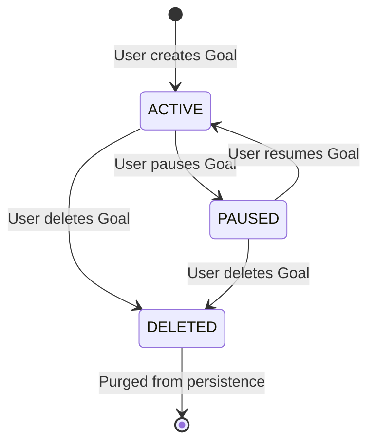
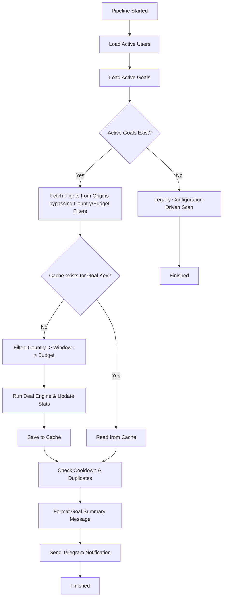

# Sprint 11: Goal-Driven Scanning Integration

This document details the architecture, design, and integration of the AI-powered Travel Goals system implemented in Sprint 11.

---

## 🏗️ Architecture Overview

The system transitions FlightPulseAI from a static, configuration-driven flight scanner to a user-centric, goal-driven monitoring engine. It is built strictly on Clean Architecture:

* **Presentation / Telegram Command Handler**: Accepts incoming user text, routes commands, catches parser exceptions, and returns human-friendly responses.
* **Use Cases (Services)**:
  * `TravelGoalService`: Encapsulates business validation (e.g. preventing duplicate goals, pausing, resuming, and deleting).
  * `NotificationPipeline`: Coordinates user-level scanning, caching, matching, and notifying.
* **Domain Layer**:
  * `TravelGoal` and `TravelGoalDraft` entities represent the core targets.
  * `TravelGoalParser` processes natural language inputs deterministically.
* **Persistence Layer**:
  * `SQLiteTravelGoalRepository` handles the database storage using standard SQLite adapters.

---

## 🔄 Goal Lifecycle

* **ACTIVE**: Goal is actively scanned. Matching flight deals trigger Telegram notifications.
* **PAUSED**: Goal remains in the database but is skipped during scan iterations.
* **DELETED**: The goal is completely removed from database storage.

---

## 🌊 Pipeline Execution Flow

For each execution run:

---

## ⚡ Performance & Caching Strategy

Every pipeline run implements a lightweight **in-memory cache** to prevent duplicate API queries and protect Deal Engine statistics from inflation.

### Key Caching Strategy:
1. **Cache Key Structure**: A tuple composed of `(country, start_date, end_date, budget)`.
2. **First Observation**: When the first user goal is processed, matching flights are filtered, passed through the `DealEngine` (updating rolling average metrics once), and the resulting list of `DealResult`s is stored in the cache.
3. **Subsequent Reuse**: For all other users with identical goals, the system retrieves processed results instantly from the cache, avoiding redundant database operations, rolling average EMA updates, and Telegram payload generation.

---

## 🔮 Future Extension Points (LLM Integration)

The `TravelGoalParser` uses deterministic rules designed for easy transition to LLM parsing:

* **Plug-and-Play LLM Service**: A new `LLMTravelGoalParser` implementing a shared `GoalParser` interface can be swapped in without modifying any dependency container bindings, controllers, or database repositories.
* **Structured JSON Outputs**: High-level prompts (using Gemini/OpenAI Structured Outputs or function calling) will parse natural language to return the structured `TravelGoalDraft` fields directly.
